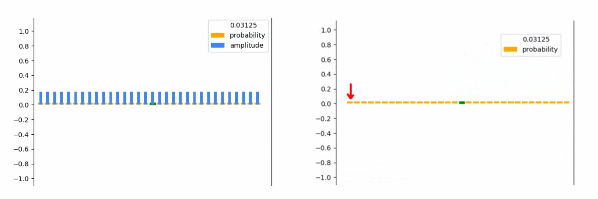

# Demonstration/Visualization of the Grover algorithm
The Grover-algorithm is a quantum algorithm that is superior to all classical algorithms when searching. On the left side we see the visualization of a grover search on the right side a classic search. The quantum algorithm is superior because it can apply operations to all possible superpositions at the same time. Whereby the classical algorithm can only always apply operations to a single state.

 

